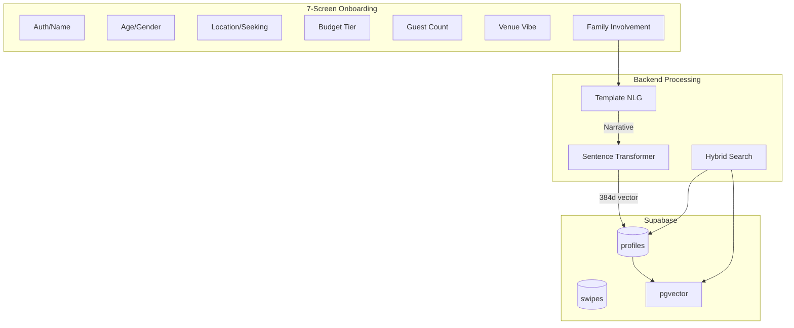

# SomeDay.love - Wedding Vision Dating App

A psychometrically-designed dating app that uses wedding planning preferences as a proxy for long-term compatibility. Built with Next.js, Supabase, and semantic matching.

## Core Concept

Instead of asking users to write bios, SomeDay.love uses structured questions about their ideal wedding day to reveal:
- **Financial alignment** (budget preferences correlate with divorce risk)
- **Family boundaries** (guest count and involvement reveal relationship dynamics)
- **Aesthetic personality** (venue style maps to MBTI traits)
- **Conflict resolution** (crisis scenarios reveal adaptability)

Matches are found using **hybrid search**: SQL filters for dealbreakers + vector similarity for vibes.

## 🏗️ Architecture



## 🛠️ Tech Stack

- **Framework**: Next.js 15 (App Router)
- **Database**: Supabase (PostgreSQL + pgvector)
- **Auth**: Clerk
- **Embeddings**: Sentence Transformers (`all-MiniLM-L6-v2`) via `@huggingface/transformers`
- **Matching**: Hybrid SQL + vector cosine similarity
- **Explanations**: OpenRouter Llama 3.2
- **UI**: shadcn/ui + Framer Motion

## ⚠️ Temporary Measures (Pre-Supabase Migration)

The following features use **mock data and localStorage** for UI development. These require refactoring before production Supabase integration:

### Mock Data Systems (`lib/mock-db.ts`)
| Feature | Current Implementation | Migration Target |
|---------|----------------------|------------------|
| **Candidates** | Static array of 8 mock profiles | Supabase hybrid search function |
| **Swipes** | localStorage (`someday_mock_swipes`) | `swipes` table with RLS |
| **Matches** | localStorage (`someday_mock_matches`) | Mutual swipe detection query |
| **Conversations** | localStorage (`someday_mock_conversations`) | `conversations` table |
| **Messages** | localStorage (`someday_mock_messages`) | `messages` table + Realtime |
| **Notifications** | localStorage (`someday_mock_notifications`) | `notifications` table + Push |
| **Last Swipe (Undo)** | localStorage (`someday_last_swipe`) | Server-side swipe reversal |

### Chat System Hooks (TODO: Replace with Supabase Realtime)
```typescript
// lib/mock-db.ts - Functions requiring Supabase migration:
getConversations()     // → SELECT * FROM conversations WHERE participant = $1
getOrCreateConversation() // → INSERT ... ON CONFLICT DO NOTHING
getMessages()          // → SELECT * FROM messages WHERE conversation_id = $1
sendMessage()          // → INSERT INTO messages + Broadcast channel
markConversationRead() // → UPDATE conversations SET unread_count = 0
```

### Notification System Hooks (TODO: Replace with Supabase)
```typescript
getNotifications()          // → SELECT * FROM notifications WHERE user_id = $1
getUnreadNotificationCount() // → COUNT(*) WHERE read = false
markNotificationRead()      // → UPDATE notifications SET read = true
markAllNotificationsRead()  // → UPDATE notifications SET read = true WHERE user_id = $1
addNotification()           // → INSERT INTO notifications
```

### Settings (Mock State Only)
Settings page stores preferences in component state. Migration requires:
- `user_preferences` table in Supabase
- Sync on mount / debounced save on change

### Features Deferred to Supabase Phase
- **Photo Upload**: Requires Supabase Storage + `profile_photos` table
- **Inline Profile Edit**: Requires profile update API endpoint
- **Real Typing Indicators**: Requires Supabase Presence channel
- **Read Receipts**: Requires `message_receipts` table


## 📊 Database Schema

### Profiles Table

| Column | Type | Description |
|--------|------|-------------|
| `id` | uuid | Primary key |
| `clerk_id` | text | Clerk user ID (unique) |
| `name` | text | Display name |
| `age` | int | User age |
| `gender` | text | User gender |
| `seeking` | text | Gender preference |
| `location` | text | City/region |
| `budget_tier` | text | `micro` \| `modest` \| `moderate` \| `lavish` |
| `guest_count` | text | `elopement` \| `intimate` \| `medium` \| `large` |
| `venue_vibe` | text | `rustic` \| `modern` \| `classic` \| `adventure` |
| `family_involvement` | int | 1-5 scale |
| `narrative` | text | Generated TBNLG text |
| `embedding` | vector(384) | MiniLM embedding |
| `created_at` | timestamptz | Profile creation |
| `updated_at` | timestamptz | Last update |

### Swipes Table

| Column | Type | Description |
|--------|------|-------------|
| `id` | uuid | Primary key |
| `user_id` | uuid | Who swiped (FK to profiles) |
| `target_id` | uuid | Who was swiped on (FK to profiles) |
| `liked` | boolean | `true` = like, `false` = pass |
| `compatibility_score` | float | 0-100 similarity score |
| `match_explanation` | text | LLM-generated explanation |
| `created_at` | timestamptz | Swipe timestamp |

**Index**: HNSW index on `profiles.embedding` for fast vector search.

## 🎨 Onboarding Flow (7 Screens)

### Phase 1: Identity (Screens 1-3)

| Screen | Fields | Time |
|--------|--------|------|
| 1 | Clerk Auth + Display Name | ~30s |
| 2 | Age + Gender | ~15s |
| 3 | Location + Seeking | ~20s |

**Total Phase 1**: ~65 seconds

### Phase 2: Wedding Vision (Screens 4-7)

| Screen | Component | Psychometric Signal |
|--------|-----------|---------------------|
| 4 | Budget Tier (4 visual cards) | Financial worldview (strongest divorce predictor) |
| 5 | Guest Count (4 visual cards) | Social style, family enmeshment |
| 6 | Venue Vibe (image grid) | Aesthetic personality (MBTI proxy) |
| 7 | Family Involvement (slider 1-5) | Boundary setting, differentiation of self |

**Total Phase 2**: ~90 seconds

**Total Onboarding**: < 3 minutes

### Budget Tier Options

| Tier | Range | Tagline |
|------|-------|---------|
| Micro | < $5,000 | "Just us and the sunset" |
| Modest | $5k - $15k | "Meaningful over extravagant" |
| Moderate | $15k - $40k | "Beautiful but balanced" |
| Lavish | $40k+ | "Once in a lifetime celebration" |

### Guest Count Options

| Count | Range | Description |
|-------|-------|-------------|
| Elopement | 2 | "Just the two of us" |
| Intimate | 2-20 | "Only our closest people" |
| Medium | 20-100 | "Friends and family" |
| Large | 100+ | "Everyone we know" |

### Venue Vibe Options

| Vibe | Examples | Personality Correlate |
|------|----------|----------------------|
| Rustic/Boho | Barn, vineyard, forest | INFP - authenticity, nature |
| Modern/Minimal | Rooftop, gallery, loft | INTJ - efficiency, status |
| Classic/Traditional | Ballroom, church, estate | ISFJ - tradition, security |
| Adventure/Elopement | Mountain, beach, destination | ESTP - experience, independence |

## 🔄 Template-Based Natural Language Generation (TBNLG)

Structured selections are converted into coherent narratives for embedding:

```typescript
// Example: The Traditionalist
"I envision a grand celebration where budget is secondary to vision 
with everyone we love in a grand celebration. My ideal atmosphere 
is timeless and traditional, honoring family and heritage. I deeply 
value family input and tradition in major decisions."

// Example: The Non-Conformist  
"I envision an intimate, budget-conscious celebration under $5,000 
with just the two of us, prioritizing intimacy over spectacle. My 
ideal atmosphere is adventurous and unconventional, prioritizing 
experience over tradition. I value independence and making decisions 
as a couple."
```

## 🔍 Hybrid Search Algorithm

Two-stage matching process:

### Stage 1: SQL Hard Filters (Dealbreakers)
- Gender match (`p.gender = user_seeking`)
- Mutual interest (`p.seeking = user_gender`)
- Same location (`p.location = user_location`)
- Budget alignment (`p.budget_tier = user_budget`)
- Exclude already-swiped profiles

### Stage 2: Vector Ranking (Vibes)
- Compute cosine similarity on `embedding` vectors
- Order by similarity descending
- Return top 20 candidates

**Why Hybrid?** Vectors excel at "fuzzy" matching (aesthetic vibes) but fail on binary constraints. "I want kids" and "I don't want kids" are semantically similar but incompatible.

## 📁 Project Structure

```
app/
├── (auth)/              # Clerk auth pages
│   ├── sign-in/
│   └── sign-up/
├── (main)/              # Protected routes
│   ├── onboarding/     # 7-screen wizard
│   ├── discover/       # Swipe interface
│   └── matches/        # Mutual matches
├── api/                # API routes
│   ├── profile/        # Create/update profile
│   ├── candidates/    # Hybrid search
│   ├── swipe/         # Record swipe
│   └── explain/       # LLM match explanation
└── page.tsx           # Landing page

lib/
├── supabase.ts        # Supabase client
├── tbnlg.ts           # Template NLG
├── embeddings.ts      # Sentence transformer
└── openrouter.ts      # LLM client

components/
├── onboarding/        # Onboarding components
├── discover/          # Swipe components
└── ui/                # shadcn components
```

## 🚀 Getting Started

### Prerequisites

- Node.js 18+ or Bun
- Supabase account
- Clerk account
- OpenRouter API key

### Installation

```bash
# Install dependencies
bun install

# Install shadcn components
bunx shadcn@latest add button card input slider radio-group progress avatar

# Set up environment variables
cp .env.example .env.local
```

### Environment Variables

```env
NEXT_PUBLIC_CLERK_PUBLISHABLE_KEY=
CLERK_SECRET_KEY=
NEXT_PUBLIC_SUPABASE_URL=
NEXT_PUBLIC_SUPABASE_ANON_KEY=
SUPABASE_SERVICE_ROLE_KEY=
OPENROUTER_API_KEY=
```

### Database Setup

Run this SQL in Supabase SQL Editor:

```sql
-- Enable pgvector
create extension if not exists vector;

-- Create profiles table
create table profiles (
  id uuid primary key default gen_random_uuid(),
  clerk_id text unique not null,
  name text not null,
  age int not null,
  gender text not null,
  seeking text not null,
  location text not null,
  budget_tier text not null,
  guest_count text not null,
  venue_vibe text not null,
  family_involvement int not null,
  narrative text,
  embedding vector(384),
  created_at timestamptz default now(),
  updated_at timestamptz default now()
);

-- Create swipes table
create table swipes (
  id uuid primary key default gen_random_uuid(),
  user_id uuid references profiles(id),
  target_id uuid references profiles(id),
  liked boolean not null,
  compatibility_score float,
  match_explanation text,
  created_at timestamptz default now(),
  unique(user_id, target_id)
);

-- Create HNSW index for vector search
create index on profiles using hnsw (embedding vector_cosine_ops);

-- Create hybrid search function
create or replace function find_matches(
  user_id uuid,
  user_gender text,
  user_seeking text,
  user_location text,
  user_budget text,
  user_embedding vector(384),
  match_limit int
) returns table (
  id uuid,
  name text,
  age int,
  venue_vibe text,
  similarity float
) as $$
begin
  return query
  select 
    p.id, p.name, p.age, p.venue_vibe,
    1 - (p.embedding <=> user_embedding) as similarity
  from profiles p
  where p.id != user_id
    and p.gender = user_seeking
    and p.seeking = user_gender
    and p.location = user_location
    and p.budget_tier = user_budget
    and p.id not in (
      select target_id from swipes where swipes.user_id = user_id
    )
  order by p.embedding <=> user_embedding
  limit match_limit;
end;
$$ language plpgsql;
```

### Development

```bash
bun run dev
```

Open [http://localhost:3000](http://localhost:3000)

## 🚀 Vercel Deployment

### One-Click Deploy

[](https://vercel.com/new/clone?repository-url=https://github.com/yourusername/someday-love)

### Manual Deployment

1. **Push to GitHub**
   ```bash
   git init
   git add .
   git commit -m "Initial commit"
   git remote add origin https://github.com/yourusername/someday-love.git
   git push -u origin main
   ```

2. **Connect to Vercel**
   - Go to [vercel.com/new](https://vercel.com/new)
   - Import your GitHub repository
   - Vercel auto-detects Next.js and Bun

3. **Set Environment Variables**
   In Vercel dashboard → Settings → Environment Variables:
   ```
   NEXT_PUBLIC_CLERK_PUBLISHABLE_KEY=pk_live_...
   CLERK_SECRET_KEY=sk_live_...
   NEXT_PUBLIC_SUPABASE_URL=https://xxx.supabase.co
   NEXT_PUBLIC_SUPABASE_ANON_KEY=eyJ...
   SUPABASE_SERVICE_ROLE_KEY=eyJ...
   OPENROUTER_API_KEY=sk-or-...
   ```

4. **Deploy**
   - Click "Deploy"
   - Vercel builds and deploys automatically

### Production Considerations

- **Auth**: Replace mock auth with Clerk middleware
- **Database**: Set up Supabase with the provided SQL schema
- **Embeddings**: Enable sentence transformer for vector search
- **Domain**: Add custom domain in Vercel settings

### Build Configuration

The `vercel.json` includes:
- Bun as the package manager
- Security headers (X-Frame-Options, CSP)
- API route caching disabled
- Region optimization (iad1)

### Environment Setup for Production

1. **Clerk**: Create production instance at [clerk.com](https://clerk.com)
2. **Supabase**: Create project and run database schema
3. **OpenRouter**: Get API key for match explanations

## 📈 Progressive Profiling (Post-MVP)

After initial onboarding, collect deeper data through gamification:

| Hook | Trigger | Data Collected |
|------|---------|----------------|
| Refine Matches | After 10 swipes | Ceremony style, first dance song |
| Crisis Quiz | After first match | "Rain on wedding day" scenario |
| This or That | Daily prompt | Aesthetic micro-preferences |

## 💬 Chat Interface Architecture (Planned)

### Overview

The chat system will leverage **Supabase Realtime** for WebSocket-based messaging between matched users. The architecture uses a hybrid approach combining instant delivery with message persistence.

### Supabase Realtime Capabilities

| Feature | Use Case | Persistence |
|---------|----------|-------------|
| **Broadcast** | Low-latency message delivery | ❌ Ephemeral |
| **Presence** | Typing indicators, online status | ❌ Ephemeral |
| **Postgres Changes** | Database event subscriptions | ✅ Persistent |

**Performance benchmarks**: 224,000 messages/second with 32,000 users at 6ms median latency.

### Hybrid Architecture Pattern

```javascript
// Broadcast for instant delivery, database for persistence
const sendMessage = async (content) => {
  const message = {
    id: crypto.randomUUID(),
    sender_id: currentUserId,
    content,
    timestamp: new Date().toISOString()
  }
  
  // Instant delivery via Broadcast
  await channel.send({
    type: 'broadcast',
    event: 'new_message',
    payload: { message }
  })
  
  // Persist to database
  await supabase.from('messages').insert(message)
}
```

### Supabase Realtime Pricing & Quotas

#### Pricing by Plan

| Plan | Monthly Cost | Connections | Messages/Month | Max Message Size |
|------|-------------|-------------|----------------|------------------|
| **Free** | $0 | 200 | 2 Million | 250 KB |
| **Pro** | $25 | 500 | 5 Million | 3 MB |
| **Team** | $599 | 500 | 5 Million | 3 MB |
| **Enterprise** | Custom | Custom | Volume discounts | Custom |

**Overage pricing (Pro/Team)**: +$10 per 1,000 connections, +$2.50 per million messages

#### Realtime Quotas

| Feature | Free | Pro | Team/Enterprise |
|---------|------|-----|-----------------|
| Concurrent connections | 200 | 500 | 10,000+ |
| Messages per second | 100 | 500 | 2,500+ |
| Channel joins per second | 100 | 500 | 2,500+ |
| Channels per connection | 100 | 100 | 100+ |
| Presence keys per object | 10 | 10 | 10+ |
| Presence messages/sec | 20 | 50 | 1,000+ |
| Broadcast payload size | 256 KB | 3 MB | 3 MB+ |
| Postgres change payload | 1 MB | 1 MB | 1 MB+ |

> [!NOTE]
> Free tier is sufficient for MVP and early growth (~200 concurrent users).
> See [Supabase Pricing](https://supabase.com/pricing) for latest details.

### Scaling Thresholds

| User Scale | Recommended Architecture |
|------------|-------------------------|
| < 1,000 | Supabase Realtime alone |
| 1,000 - 10,000 | Supabase Pro + Redis for presence caching |
| 10,000 - 100,000 | Redis Pub/Sub + multiple WebSocket servers |
| 100,000+ | Custom infrastructure or Enterprise tier |

### Chat Database Schema (Planned)

#### Conversations Table

| Column | Type | Description |
|--------|------|-------------|
| `id` | uuid | Primary key |
| `participant_1` | uuid | FK to profiles |
| `participant_2` | uuid | FK to profiles |
| `status` | text | `active` \| `archived` \| `blocked` |
| `last_message_preview` | text | Truncated last message |
| `last_message_at` | timestamptz | For sorting |
| `created_at` | timestamptz | Conversation start |

#### Messages Table

| Column | Type | Description |
|--------|------|-------------|
| `id` | uuid | Primary key |
| `conversation_id` | uuid | FK to conversations |
| `sender_id` | uuid | FK to profiles |
| `content` | text | Message content |
| `type` | text | `text` \| `image` \| `emoji` |
| `created_at` | timestamptz | Message timestamp |

#### Message Receipts Table

| Column | Type | Description |
|--------|------|-------------|
| `id` | uuid | Primary key |
| `message_id` | uuid | FK to messages |
| `user_id` | uuid | FK to profiles |
| `delivered_at` | timestamptz | Delivery timestamp |
| `read_at` | timestamptz | Read timestamp |

#### Typing Status Table

| Column | Type | Description |
|--------|------|-------------|
| `conversation_id` | uuid | FK to conversations |
| `user_id` | uuid | FK to profiles |
| `is_typing` | boolean | Current typing state |
| `updated_at` | timestamptz | Last update |

#### Blocked Users Table

| Column | Type | Description |
|--------|------|-------------|
| `blocker_id` | uuid | Who blocked |
| `blocked_id` | uuid | Who was blocked |
| `created_at` | timestamptz | Block timestamp |

### Critical Indexes

```sql
-- Efficient message loading
CREATE INDEX idx_messages_conversation_time 
ON messages(conversation_id, created_at DESC);

-- Conversation lookups by participant
CREATE INDEX idx_conversations_participant_1 
ON conversations(participant_1);
CREATE INDEX idx_conversations_participant_2 
ON conversations(participant_2);
```

### Row Level Security (RLS)

```sql
-- Users can only read messages from their conversations
CREATE POLICY "Users can read own messages" ON messages
FOR SELECT USING (
  auth.uid() IN (
    SELECT participant_1 FROM conversations WHERE id = conversation_id
    UNION
    SELECT participant_2 FROM conversations WHERE id = conversation_id
  )
);

-- Users can only send messages to conversations they're in
CREATE POLICY "Users can send own messages" ON messages
FOR INSERT WITH CHECK (
  sender_id = auth.uid() AND
  auth.uid() IN (
    SELECT participant_1 FROM conversations WHERE id = conversation_id
    UNION
    SELECT participant_2 FROM conversations WHERE id = conversation_id
  )
);
```

### Feature Roadmap

| Feature | Priority | Complexity |
|---------|----------|------------|
| Basic text messaging | P0 | Medium |
| Typing indicators | P1 | Low |
| Read receipts | P1 | Low |
| Online status | P1 | Low |
| Image sharing | P2 | Medium |
| Emoji reactions | P2 | Low |
| Message deletion | P2 | Medium |
| Block/report | P0 | Medium |

---

## 🧪 Research Foundation

This app is built on research showing:

1. **Financial alignment predicts divorce**: High wedding spending correlates with 1.6-3.5x higher divorce risk
2. **Family boundaries matter**: Guest count and parent involvement reveal relationship dynamics
3. **Aesthetic choices reflect personality**: Venue style maps to MBTI traits (INFP → Rustic, INTJ → Modern)
4. **Progressive profiling reduces churn**: 7 screens vs 11 screens increases conversion by 160%

## 📝 License

MIT
